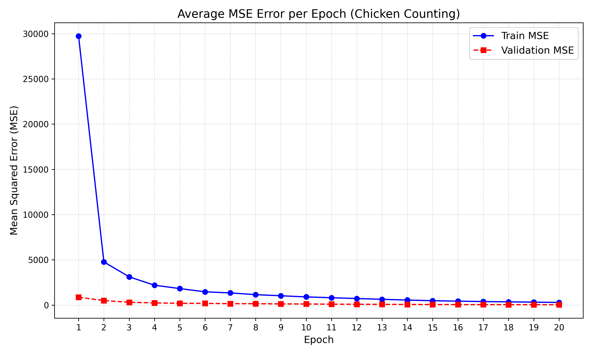

# Chicken Counting

## Overview

The objective of this task is to generate density maps for chicken images. The input image shape is [3, 720, 1280], meaning there are 3 RGB channels and the image resolution is 720 (height) x 1280 (width). The output density map is constrained to [1, 180, 320].

> This task is a continuation of the take-home weather forecasting task, though it is not as closely related to the take-home task.

---

## Problem Setup

- Input dimensions: [3, 720, 1280]
- Output density map dimensions: [1, 180, 320]
- Goal: estimate a spatial density map that reflects the number of chickens in each image.

---

## Baseline Information

| Optimizer | Initial Learning Rate | Gamma | Weight Decay | Total Epochs | Batch Size | Train Time | Accuracy |
|:---------:|:---------------------:|:-----:|:------------:|:------------:|:----------:|:----------:|:--------:|
| Adam | 1e-4 (0.0001) | 0.99999 | 1e-4 (0.0001) | 20 | 8 | 10 minutes | 0.69020 |

```python
def __init__(self, in_channels=3):
    super(FeatureExtraction, self).__init__()
    self.conv1 = nn.Conv2d(in_channels, 64, kernel_size=3, padding=2, dilation=2)
    self.conv2 = nn.Conv2d(64, 64, kernel_size=3, padding=2, dilation=2)
    self.pool2 = nn.MaxPool2d(kernel_size=2, stride=2, padding=0)
    self.conv3 = nn.Conv2d(64, 128, kernel_size=3, padding=2, dilation=2)
    self.conv4 = nn.Conv2d(128, 128, kernel_size=3, padding=2, dilation=2)
    self.pool4 = nn.MaxPool2d(kernel_size=2, stride=2, padding=0)

    # The two MaxPool2d layers reduce the image size from 720 x 1280 to 180 x 320.
```

The two max-pooling layers reduce the spatial size as follows:

- 720 x 1280 -> 360 x 640
- 360 x 640 -> 180 x 320

This matches the required output dimensions while retaining the important spatial features needed for density estimation.

---

## Thought Process

At the competition, the initial approach was pretty simple. The most direct way to improve model accuracy is typically to increase the depth of the network, increase the number of feature channels between layers, or tune hyperparameters. At the same time, the training runtime had to remain under 20 minutes, so the model could not be overly complex. There were only 100 training samples, which also made overfitting a significant concern for custom CNNs.

### Initial Approach

| Optimizer | Initial Learning Rate | Gamma | Weight Decay | Total Epochs | Batch Size | Train Time | Accuracy |
|:---------:|:---------------------:|:-----:|:------------:|:------------:|:----------:|:----------:|:--------:|
| Adam | 1e-4 (0.0001) | 0.9999 | 5e-4 (0.0005) | 15 | 8 | 9 minutes | 0.67223 |

```python
def __init__(self, in_channels=3):
    super(FeatureExtraction, self).__init__()
    self.conv1 = nn.Conv2d(in_channels, 64, kernel_size=3, padding=2, dilation=2)
    self.conv2 = nn.Conv2d(64, 64, kernel_size=3, padding=2, dilation=2)
    self.pool2 = nn.MaxPool2d(kernel_size=2, stride=2, padding=0)
    self.conv3 = nn.Conv2d(64, 128, kernel_size=3, padding=2, dilation=2)
    self.conv4 = nn.Conv2d(128, 128, kernel_size=3, padding=2, dilation=2)
    self.pool4 = nn.MaxPool2d(kernel_size=2, stride=2, padding=0)
```

This version only adjusted the hyperparameters, though it is not very efficient and even less accurate than the baseline model. So how can we improve it? Initially, I was just hyperparameters tuning and changing the model architecture. At the final ~15 minutes I remembered that ResNet18, ResNet34, ResNet50 was allowed and downloaded in our machines and the input channels of ResNet and the chicken images are both 3, therefore I modified the model to ResNet and give up the given base weights and use ResNet's weights. At first, I was using ResNet34 and I got around ~85-88% accuracy. Then, I changed it to ResNet50 and got the final score of ~93%.

### My Solution

| Optimizer | Initial Learning Rate | Gamma | Weight Decay | Total Epochs | Batch Size | Train Time | Accuracy |
|:---------:|:---------------------:|:-----:|:------------:|:------------:|:----------:|:----------:|:--------:|
| Adam | 1e-4 (0.0001) | 0.9 | 5e-4 (0.0005) | 20 | 8 | 9 minutes | 0.91951 |



```python
def __init__(self, use_pretrained=True):
    super(ResNet50Extractor, self).__init__()
    
    weights = ResNet50_Weights.DEFAULT if use_pretrained else None
    resnet = resnet50(weights=weights)
    
    # Extract layers up to layer4 (dropping the avgpool and fc layers)
    self.conv1 = resnet.conv1
    self.bn1 = resnet.bn1
    self.relu = resnet.relu
    self.maxpool = resnet.maxpool
    
    self.layer1 = resnet.layer1  # Outputs 256 channels
    self.layer2 = resnet.layer2  # Outputs 512 channels
    self.layer3 = resnet.layer3  # Outputs 1024 channels
    self.layer4 = resnet.layer4  # Outputs 2048 channels

def forward(self, x):
    x = self.conv1(x)
    x = self.bn1(x)
    x = self.relu(x)
    x = self.maxpool(x)
    
    x = self.layer1(x)
    x = self.layer2(x)
    x = self.layer3(x)
    x = self.layer4(x)
    
    return x
```

We do not need the last layer of the ResNet model because we do not need to do classification. We will also use ResNet50's weight instead of the weight given (base.pth). We first pass the image through the 4 layers of ResNet to do feature extraction and encode the image. Then we can build the decoder to decode the image and get our desired density map of size [1, 180, 320].

```python
def __init__(self):
    super(ResNetDensityDecoder, self).__init__()
    # ResNet-50 layer4 outputs 2048 channels. 
    # We step down the channels gradually.
    self.conv1 = nn.Conv2d(in_channels=2048, out_channels=512, kernel_size=3, padding=1)
    self.conv2 = nn.Conv2d(in_channels=512, out_channels=128, kernel_size=3, padding=1)
    # Final output layer for the density map
    self.conv_out = nn.Conv2d(in_channels=128, out_channels=1, kernel_size=1)
```
We can start to decode the image back to one channel.

```python
def forward(self, x, target_size):
    # Reduce channels to 512 and upscale by 2x
    x = F.relu(self.conv1(x))
    x = F.interpolate(x, scale_factor=2, mode='bilinear', align_corners=False)
    
    # Reduce channels to 128
    x = F.relu(self.conv2(x))
    
    # Upscale explicitly to the target image dimensions (e.g., 180x320)
    x = F.interpolate(x, size=target_size, mode='bilinear', align_corners=False)
    
    # Output layer with ReLU to ensure density values are strictly positive
    x = F.relu(self.conv_out(x))
    return x
```

In between the layers we have to scale the image up to fit our required size.

```python
for param in model.feature_extraction.conv1.parameters(): param.requires_grad = False
for param in model.feature_extraction.bn1.parameters(): param.requires_grad = False
for param in model.feature_extraction.layer1.parameters(): param.requires_grad = False
for param in model.feature_extraction.layer2.parameters(): param.requires_grad = False
```

This method offers 2 main advantages.
1. Faster computation time because fewer weights to update per epoch
2. The layers can preserve their original weights

### Official Solution Comparison
| Optimizer | Initial Learning Rate | Gamma | Weight Decay | Total Epochs | Batch Size | Train Time | Accuracy | Model |
|:---------:|:---------------------:|:-----:|:------------:|:------------:|:----------:|:----------:|:--------:|:-----:|
| Adam | 1e-4 (0.0001) | 0.99999 | 1e-4 (0.0001) | 20 | 8 | 16 minutes | 0.90587 | UNet (Official) |
| Adam | 1e-4 (0.0001) | 0.9 | 5e-4 (0.0005) | 20 | 8 | 9 minutes | 0.91951 | ResNet50 (Mine) |
---

## Summary

Overall, ResNet50 outperform custom CNNs in both computing time and accuracy despite giving up the pretrained weights given by the baseline. My solution saw a -44% decrease in computing time and a 1.5% increase in accuracy.