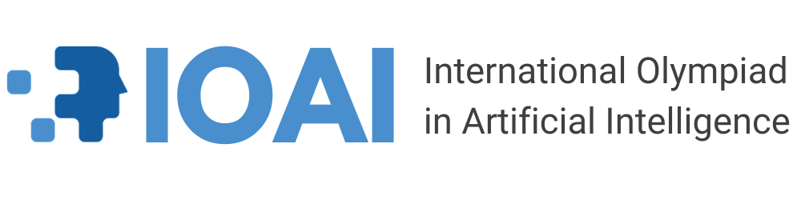

# IOAI 2025

## My solutions and thought process for the International Olympiad in Artificial Intelligence 2025 (Beijing)

## Overview

IOAI is the International Science Olympiad in Artificial Intelligence for high school students. Beyond the annual global competition week and academic/social programs, it connects regional Olympiads and supports national IOA communities worldwide.

In IOAI 2025 (Beijing), the individual contest included 6 tasks across 2 days. The competition focused mainly on machine learning, computer vision, and natural language processing. The first 3 tasks in the first day of competition are extension to the take-home tasks except Task 2 Chicken Counting. In this repository, I will be going over my thought process and solutions for the IOAI 2025 at the time.

## Competition tasks

| # | Task | Topic | Mean score |
|---|------|-------|------------|
| 1 | Radar | Computer Vision | 73.4 |
| 2 | Chicken Counting | Computer Vision | 26.1 |
| 3 | Concepts | Natural Language Processing | 19.1 |
| 4 | Restroom | Computer Vision | 3.98 |
| 5 | Antique | Machine Learning | 47.7 |
| 6 | Pixel | Computer Vision | 25.5 |

## My results

| Rank | Name | Radar | Chicken Counting | Concepts | Restroom | Antique | Pixel | Total | Medal |
|:----:|:----:|:-----:|:----------------:|:--------:|:--------:|:-------:|:-----:|:-----:|:-----:|
| 54 / 284 | Mike | 92.11 | 100.00 | 30.25 | 0.00 | 59.33 | 14.40 | 296.09 / 600 | Silver |

## Folder Hiearachy

IOAI2025/
├── README.md
├── Individual-Contest/
│   ├── Radar/
│   │   ├── README.md
|   |   ├── my_solution.ipynb
│   │   ├── solution.ipynb 
│   │   └── baseline/
│   └── Chicken_Counting/
│       ├── README.md
│       └── ...
└── requirements.txt

## Notes

This repository documents my work, experiments, and solutions for the tasks I tackled during the competition. It is meant as a personal record of learning, problem-solving, and technical exploration in AI.
